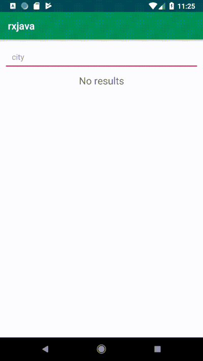

# Rxjava-Examples
[A tutorial using Publish, Debounce, and Subject](https://medium.com/@shivamdhuria/learn-by-doing-android-diving-into-rxjava-rxandroid-publishsubject-map-function-and-debounce-15022befb21c)

# Pagination

[Learn By Doing Android, RxJava and RxAndroid(Pagination)](https://medium.com/@shivamdhuria/learn-by-doing-android-rxjava-and-rxandroid-pagination-6557aa6bbab8)

# Concurrency

[Learn By Doing Android, Diving into RxJava & RxAndroid (Concurrency)](https://medium.com/swlh/learn-by-doing-android-diving-into-rxjava-rxandroid-concurrency-b43b26a3969)

